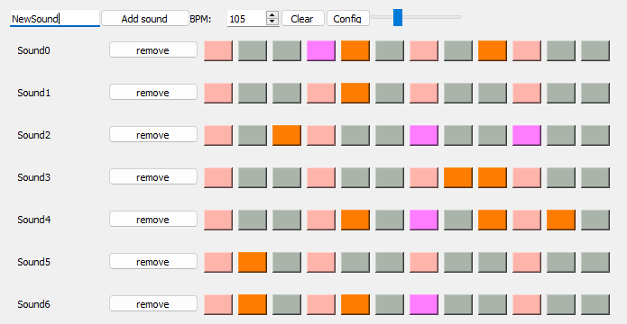

#  qbeater

Drum machine with electronic sound.

## Development

### Tasks

> - [X] ~~Create repository~~ 
> - [X] ~~Make the SRS~~
> - [X] ~~Create the core~~
> - [X] ~~Create a minimal UI~~
> - [X] ~~Create the full UI~~
> - [ ] Join UI and core
> - [ ] Create an electronic sounds
> - [ ] Pack the project with PyInstaller
> - [ ] Make the users introduction quide

### Dependencies

- PyQt5
- PyInstaller

## SRS

### Goal

Prrogram with a drum-machine functionality

### About music

#### Russian sources

- [About rhythm](https://muz-teoretik.ru/ritm-i-metr-v-muzyke-chto-eto-takoe-i-zachem-oni-nuzhny/)
- [About time sigmature](https://muz-teoretik.ru/muzykalnyj-razmer/)
- [About tempo](https://muz-teoretik.ru/tempy-v-muzyke/)

### Functions review

- Program of the sound sequence
- Inclusion of custom sounds
- Exclusion of sounds
- BPM dynamic control
- Volume dynamic control
- Time signature preset
- Amount of tacts preset

### System

- OS: Windows 10 or later

## Author

> #### fedoseevtaf
> 
> 

### Project manager

> #### Mathematician2000
>
>
