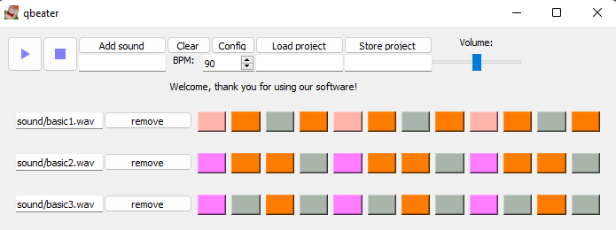

#  qbeater

Drum machine with electronic sound.

## For user:

- [Download](https://github.com/fedoseevtaf/qbeater/archive/refs/heads/dist.zip)

### Build from source

- [Download source (github)](https://github.com/fedoseevtaf/qbeater/archive/refs/heads/main.zip)

#### Dependencies

- Python 3.8 or later

#### Step by step

- Unzip archive
- Open terminal in folder with code
- Run on terminal:

#### Windows

Don't use PowerShell instead of cmd.

> py -m venv .\ \
scripts\activate.bat\
pip install --upgrade pip\
pip install -r requirements.txt\
pip install -r requirements_for_build.txt\
pyinstaller --nowindowed ^\
            --add-data=icons;icons ^\
            --add-data=sound;sound ^\
            --add-data=basic.qbp;. ^\
            qbeater.pyw\
scripts\deactivate.bat

#### Linux

> python3 -m venv ./\
source bin/activate\
pip install --upgrade pip\
pip install -r requirements.txt\
pip install -r requirements_for_build.txt\
pyinstaller --nowindowed \ \
            --add-data=icons;icons \ \
            --add-data=sound;sound \ \
            --add-data=basic.qbp;. \ \
            qbeater.pyw\
deactivate

- After that you can find the build in `dist/qbeater`

## SRS

### Goal

Prrogram with a drum-machine functionality

### About music

#### Russian sources

- [About rhythm](https://muz-teoretik.ru/ritm-i-metr-v-muzyke-chto-eto-takoe-i-zachem-oni-nuzhny/)
- [About time sigmature](https://muz-teoretik.ru/muzykalnyj-razmer/)
- [About tempo](https://muz-teoretik.ru/tempy-v-muzyke/)

### Features review

- [X] Program of the sound sequence
- [X] Inclusion of custom sounds
- [X] Exclusion of sounds
- [X] BPM dynamic control
- [X] Volume dynamic control
- [X] Time signature preset
- [X] Amount of tacts preset
- [X] Saving the project files

### System

- OS Windows 10 or later
- Linux (only build from source)

## Development

### Tasks

> - [X] ~~Create repository~~ 
> - [X] ~~Make the SRS~~
> - [X] ~~Create the core~~
> - [X] ~~Create a minimal UI~~
> - [X] ~~Create the full UI~~
> - [X] ~~Make MVP~~
> - [X] ~~Join UI and core~~
> - [X] ~~Pack the project with PyInstaller~~
> - [X] ~~Make the build from source tutorial~~

### Dependencies

- PyQt5

#### For build

- PyInstaller

### Tools

- PyInstaller
- pylint

## Author

> #### fedoseevtaf
> 
> 

### Project manager

> #### Mathematician2000
>
>
